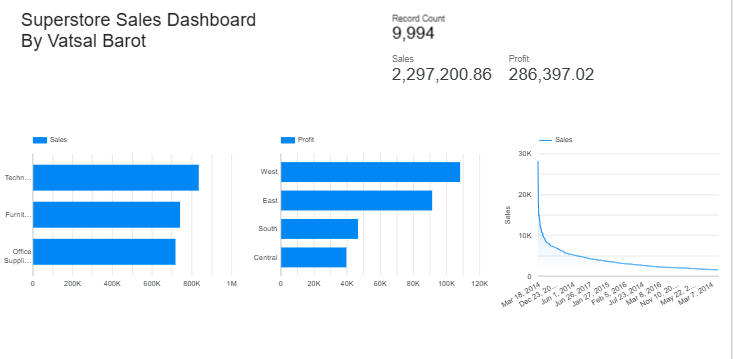

# Superstore Sales Dashboard
**By: Vatsal Barot**
**Tool: Google Looker Studio**

## 📊 Project Overview
Built an interactive dashboard analyzing 9,994 rows
of US Superstore retail data to visualize sales
performance, profitability and regional trends.

## 📈 Dashboard Components
- 3 KPI Scorecards — Total Sales, Profit, Orders
- Sales by Category Bar Chart
- Profit by Region Bar Chart
- Sales Trend Line Chart

## 🔍 Key Insights
1. Technology leads sales at $836K (36% of total)
2. West region most profitable at $108K
3. Total profit margin = 12.5% across all categories

## 🛠️ Tools Used
- Google Looker Studio
- Google Sheets
- Data Cleaning & Formatting
- 
- ## 📸 Dashboard Preview

